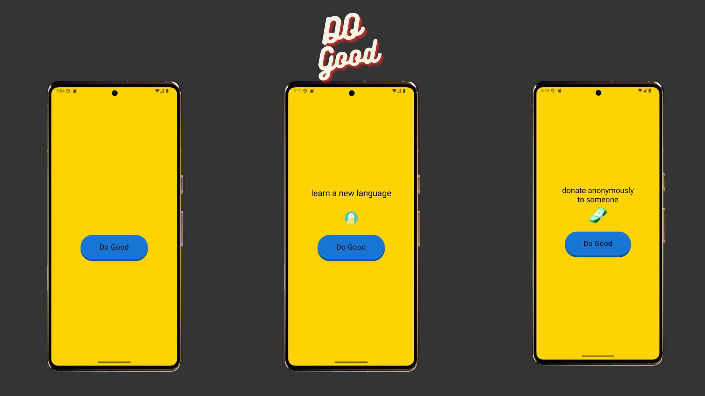

# Do Good App 🌟

Do Good Deeds A Modern Android App Built with Kotlin & Compose”
This project demonstrates modern Android development practices and clean architecture while integrating **Supabase** for backend functionality.

---

## Features

- Perform “Good Deeds” with a single button tap.
- Modern, clean UI built entirely with **Jetpack Compose**.
- Lightweight and easy to extend for further features.

---

## Screenshots



---

## Development Environment

- **Android Studio** (latest stable version)
- **Gradle** build system
- **Kotlin** + **Jetpack Compose**

---

## Architecture & Modularization

- Fully **modularized** for reusable components.
- Dependency Injection with **Hilt** for easier testing.
- ViewModel for State Holder
- UI and data layers separated, with test doubles replacing production implementations in tests.

---

## Testing

- Unit tests: `./gradlew testDemoDebug`
- Instrumented tests: `./gradlew connectedDemoDebugAndroidTest`

---

## UI Design

- Material 3 design system
- Jetpack Compose-based screens
- Dark mode support

---

## Getting Started

1. Clone the repo:

```bash
git clone https://github.com/KoneMuhammad/dogood.git
